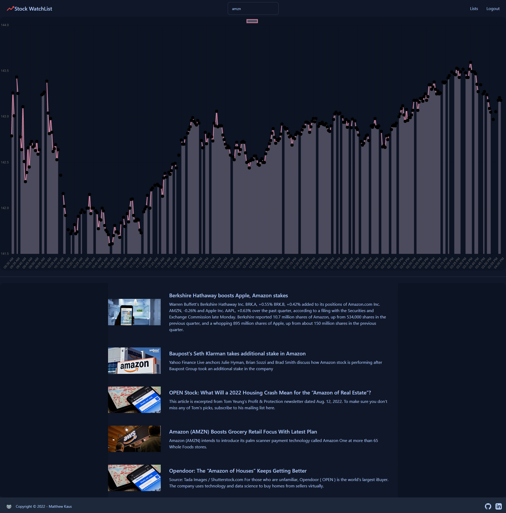

  <h1>Stock Watchlist</h1>

## Description
With Stock WatchList, users are able to search for specific stocks and are given a graphic repesentation of the stock pricing, as well as the latest headlines.

## Technology 
* <strong>Techstack</strong> - MongoDB, Express.js, Svelte, Node, GraphQL
* <strong>Styling</strong> - Tailwind, Daisy UI
* <strong>Data Visualization</strong> - Chart.js
* <strong>Deployment</strong> - Heroku

<h2>Contact</h2>

 

